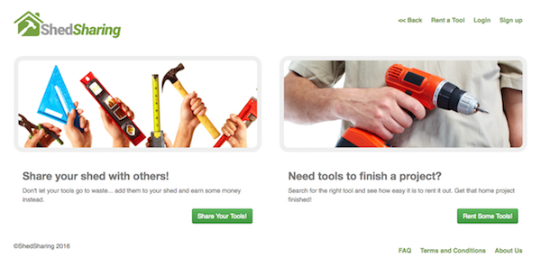

### Shed Sharing

#### Purpose:
 * This web app is designed to allow users to rent tools from other individuals in their local area and have users place tools they own up for rent.

#### User Stories:
##### Owner
* An owner can register a tool to be rented.
* An owner receives notification when they receive a tool request.
* An owner can confirm a tool request and schedule a pickup time.
* An owner can confirm pickup of a tool.
* An owner can confirm when a tool has been returned.

##### Renter
* A public user can search for a tool to rent.
* A public user can sign up for an account, which allows them to rent a tool.
* A renter can click a "rent now" button to initiate a tool rental request.
* A renter is notified when the owner has confirmed a tool request, and confirm a pickup time.
* A renter can confirm pickup of the tool.
* A renter can schedule a time to return tool & confirm the action.
* A renter can confirm return of the tool.

##### The Team
* [Elliot Wolfe](https://github.com/Wolfy858)
* [Gabriel Bonner](https://github.com/gabrielbonner)
* [Mike Laurel](https://github.com/mlaurel)
* [Patrick Allen](https://github.com/Tokap)

-----------------------------------------------------------------------------------

#### Configuration:
 * Ensure local Ruby Version is 2.1.5
 * Built using Ruby on Rails 4
 * Styled with SCSS
 * This app relies on a number of Gems - run bundle install
 * You'll need 'ImageMagick' to be able to add pictures of tools (on OSX, `$brew install imagemagick`)
 * Create and Migrate Database - uses Postgresql
 * Seed DB only if mock data is required
 * Mock data contains fake user login; refer to seed file for details, however you can use 'allenpatrick86@gmail.com' and 'password' to log in as a user who already has rental history

#### Deployment instructions:
 * Optimized for Heroku deployment (Postgresql Database)
 * https://devcenter.heroku.com/articles/getting-started-with-rails4

### Development branch deployment
 * For deployment of the development branch on the staging server, run the following tasks.
 * Note: Beforehand, you will need to set staging as heroku git remote repositories.  Use the following command to add staging remote to your repo
 * git remote add staging https://git.heroku.com/share-shed-stage.git

 * Note: Optional tasks for dropping and recreating the database are noted below.
 1. git pull origin development
 2. git push staging development:master
 3. (optional) heroku pg:reset DATABASE --app share-shed-stage --confirm share-shed-stage
 4. (optional) heroku run rake db:migrate --remote staging
 5. (optional) heroku run rake db:seed --remote staging
 6. http://stage.shedsharing.com

### Master Branch
 * For deployment of the master branch on the production server, run the following tasks.
 * Note: Beforehand, you will need to set prod as heroku git remote repositories.  Use the following command to add prod remote to your repo
 * git remote add prod https://git.heroku.com/share-shed.git

 * Note: Optional tasks for dropping and recreating the database are noted below.
 1. Create a pull request to merge the development branch into master
 2. git pull origin master
 3. git push prod master
 4. (optional) heroku pg:reset DATABASE --app share-shed --confirm share-shed
 5. (optional) heroku run rake db:migrate --remote prod
 6. (optional) heroku run rake db:seed --remote prod
 7. http://www.shedsharing.com
